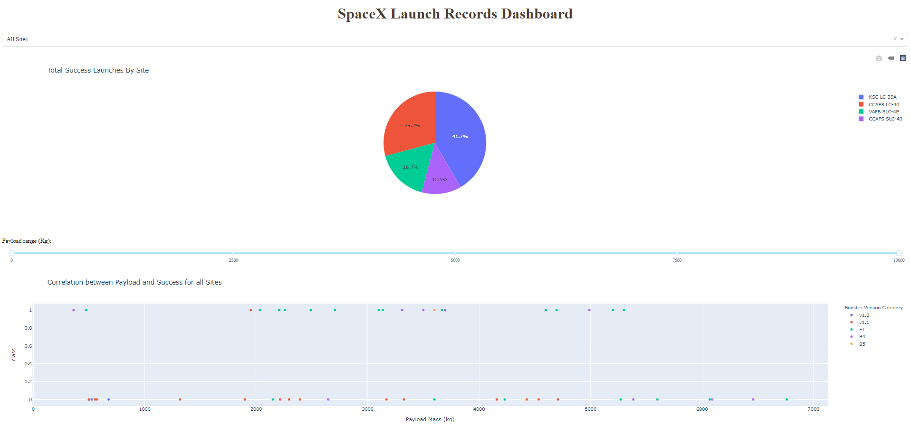

# SpaceX Launch Records Dashboard

An interactive dashboard application that visualizes SpaceX launch data, built with Python.

## Features

- **Launch Site Selection**: Filter data by selecting a specific launch site or view all sites
- **Success Analytics**: Pie chart showing the total successful launches count for all sites, or success vs. failed counts for a specific site
- **Payload Analysis**: Interactive range slider to filter launches by payload mass (kg)
- **Correlation Visualization**: Scatter chart showing the correlation between payload mass and launch success

## Project Overview



## Requirements

- Python 3.x
- pandas
- dash
- plotly

## Installation

1. Clone or download this project:
```bash
cd Dashboard_Application
```

2. Install the required dependencies:
```bash
pip install pandas dash plotly
```

## Running the Application

1. Ensure you have the `spacex_launch_dash.csv` file in the project directory

2. Run the application:
```bash
python spaceX-dash-app.py
```

3. Open your web browser and navigate to:
```
http://127.0.0.1:8050/
```

The dashboard will load with all SpaceX launch records. Use the interactive elements to explore the data:
- **Dropdown**: Select a launch site to filter the data
- **Range Slider**: Adjust the payload mass range to see relevant launches
- **Charts**: Hover over the charts to see detailed information

## Data Source

The application uses SpaceX launch data from the `spacex_launch_dash.csv` file, which contains launch records including:
- Launch site information
- Payload mass
- Launch success/failure status
